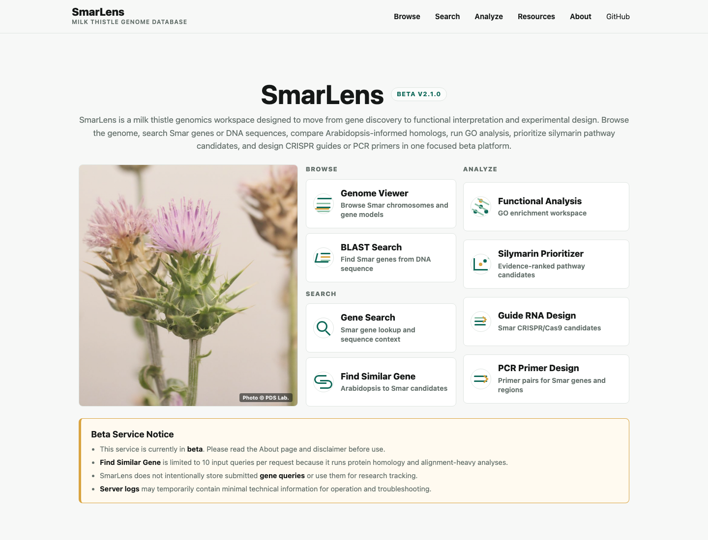

# SmarLens

SmarLens is a public beta web service for milk thistle (*Silybum marianum*) genome exploration and analysis.


```text
https://smarlensdb.org
```

Current beta version:

```text
v2.1.0-beta
```



## Repository Scope

This public repository provides documentation, selected frontend assets, screenshots, release notes, data attribution, and public reference code for SmarLens.

It does not contain the production backend, production database, runtime indexes, raw data bundles, server configuration, admin dashboard, monitoring scripts, backup scripts, Slack webhook integration, or unpublished prioritization/evidence modules.

The production service at `https://smarlensdb.org` is the authoritative beta implementation.

See [`PUBLIC_REPOSITORY.md`](PUBLIC_REPOSITORY.md) for the public/private boundary used during the pre-publication beta phase.

## Main Tools

- Genome Viewer
- BLAST Search
- Search Gene
- Find Similar Gene
- Functional Analysis
- Silymarin Prioritizer
- Guide RNA Design
- PCR Primer Design

## Public Beta Limits

The public server is intended for early testing and feedback. Heavy analyses are limited to protect server availability. Current examples include:

- Find Similar Gene is limited to 10 input queries per request.
- GO gene lists are limited to 1,000 submitted genes.
- GO background lists are limited to 100,000 genes.
- Sequence-based tools use task-specific sequence-length and result-count limits.
- Heavy external jobs have timeouts and limited concurrency.

SmarLens does not intentionally store submitted gene queries or use them for research tracking. Server logs may temporarily contain minimal technical information required for service operation, security, and troubleshooting.

## Public Reference Code

The `public/` folder contains a minimal public stub server and workflow descriptions.

```bash
python3 public/public_app.py
```

Open:

```text
http://127.0.0.1:8765
```

This public stub is not intended to reproduce the production service locally. It documents the public API surface and clearly reports that production analyses require the public beta server.

## Data Sources

The genome assembly and annotation are based on the chromosome-level milk thistle genome resource reported by Kim et al., 2024.

Reference DOI:

```text
https://doi.org/10.1038/s41597-024-03178-3
```

Associated public dataset:

```text
https://figshare.com/articles/dataset/_i_Silybum_marianum_i_genome_assembly_and_annotation/24190023/2
```

Additional data-source details are provided in the SmarLens Resources and About pages.

## Changelog

Release notes are tracked in [`CHANGELOG.md`](CHANGELOG.md).

## Disclaimer

SmarLens is provided as a research-oriented beta resource. The developers and affiliated laboratory do not warrant, and do not assume legal liability or responsibility for, the accuracy, completeness, or usefulness of any data, annotation, analysis result, software output, document, or related information made available through this tool.

All computational results should be interpreted as supporting evidence and require independent biological and experimental validation.

## Contact

Pipeline maintained by Janghyun Choi.

```text
jchoi@inha.ac.kr
```
